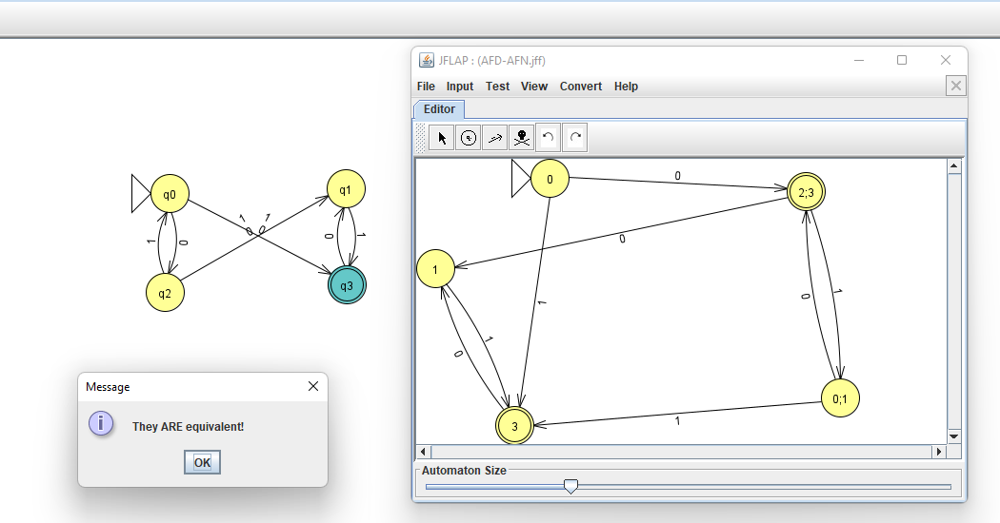
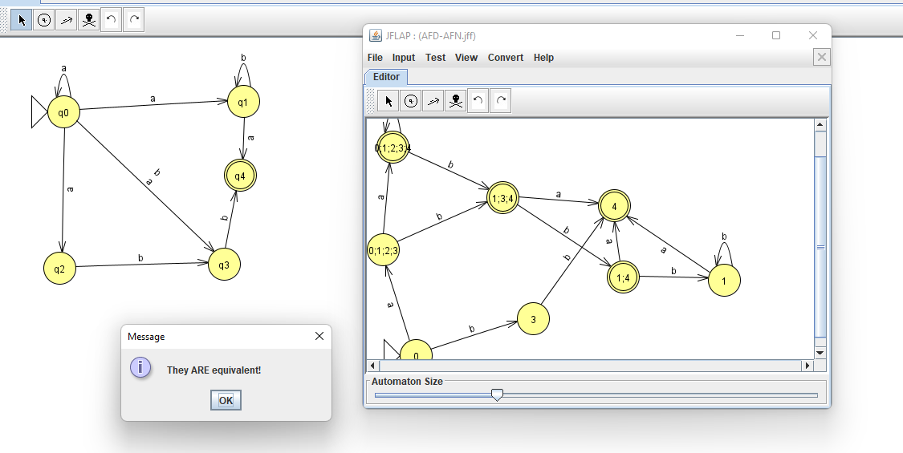

# Se não Tiver node.

[NodeJS](https://nodejs.org/en/download/)

# Para instalar dependências

```
npm install
```

Ou

```
yarn
```

# Para rodar no terminal

```
npm run start file=<filename> sentence=<sentence>
```

ou

```
yarn start file=<filename> sentence=<sentence>
```

```
EX:
  npm run start file=AFN.jff sentence=aaaabbab
  OR
  yarn start file=AFN.jff sentence=aaaabbab
```

```
Nesse caso temos um arquivo de teste Default AFN.jff.
Se não quiser especificar o arquivo, é só informar a sentenca.

EX: yarn start sentence=aaaabbab
```

```
Podemos ver os passos tanto verticalmente como horizontalmente.
Basta colocar a flag breakOnLog

EX:

yarn start sentence=aaa
[1, aaa] |- [2, aa] |- [2;3, a] |- [2;3, λ]

yarn start sentence=aaa breakOnLog
[1, aaa]
  v
[2, aa]
  v
[2;3, a]
  v
[2;3, λ]
```

# Leitura de formatos aceitos:

### JFLAP

# Testes

## Teste 1



## Teste 2


